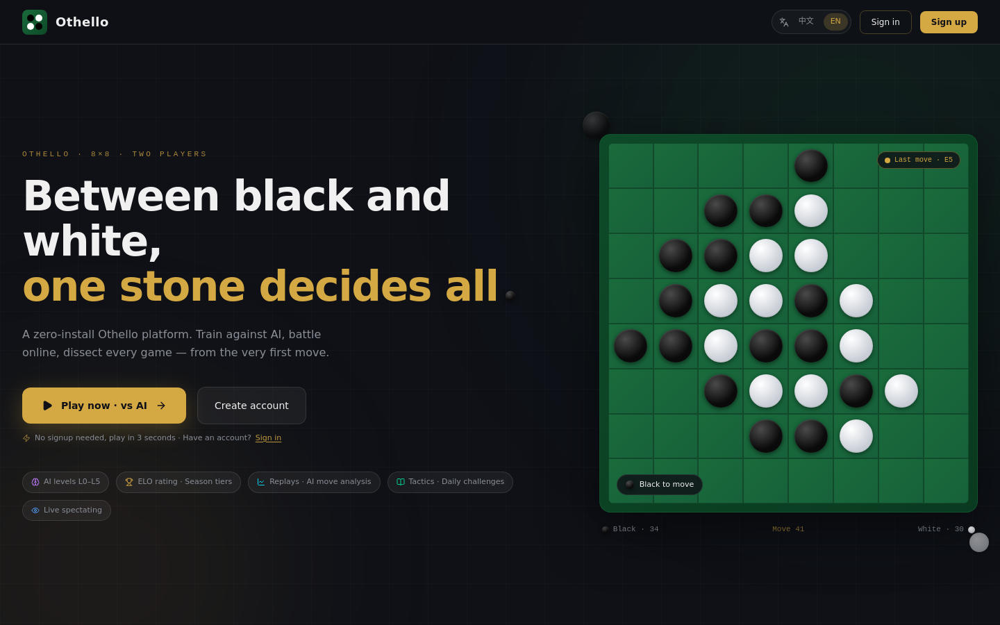
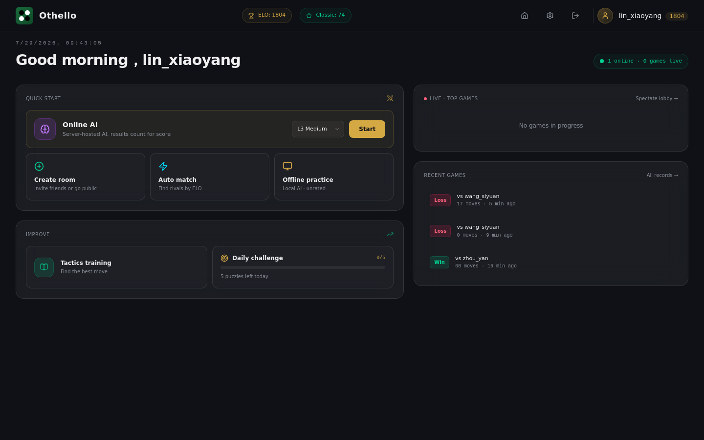
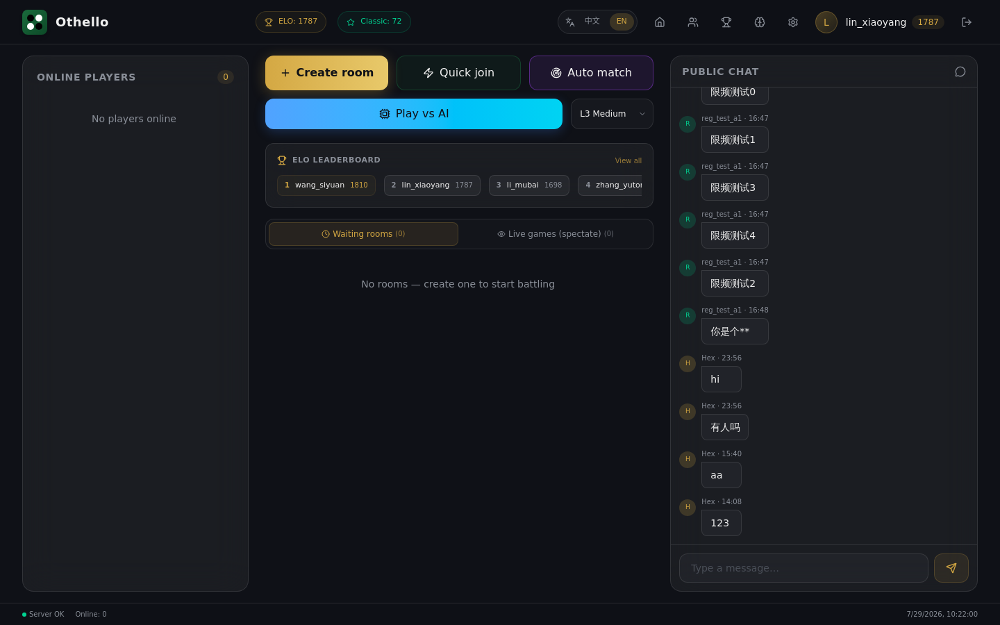
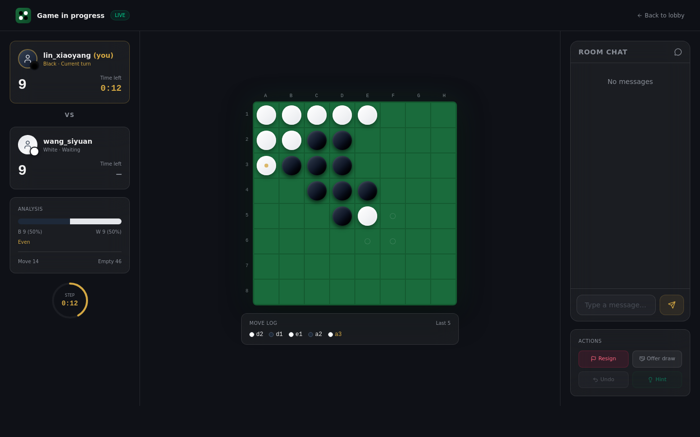
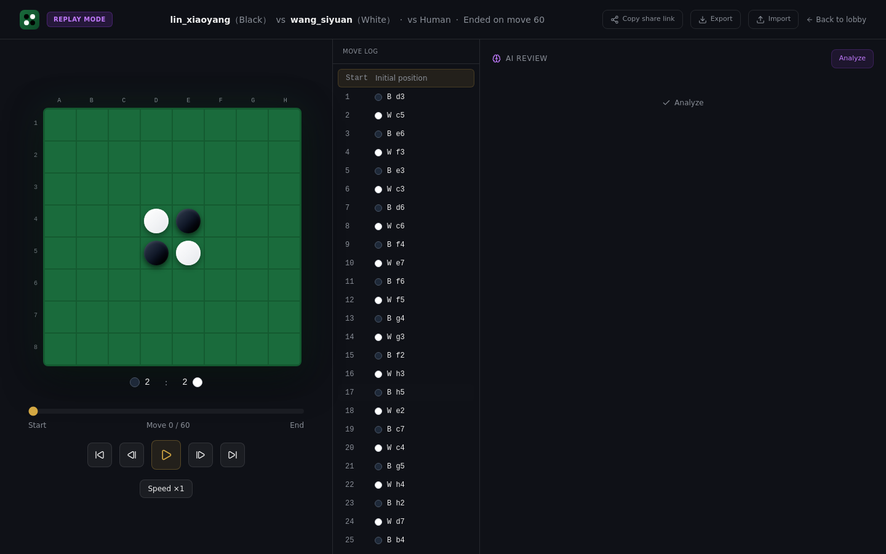
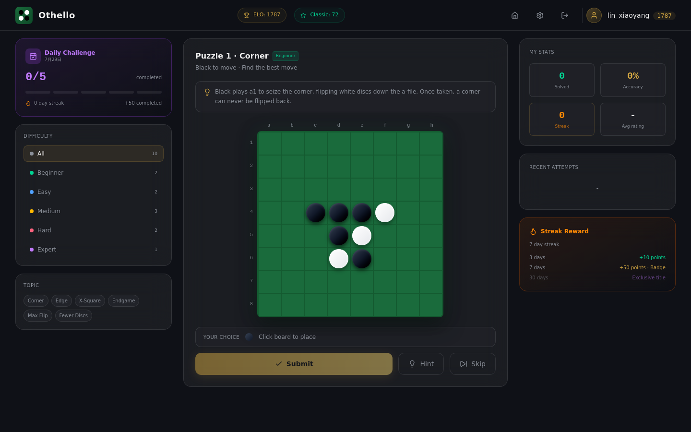
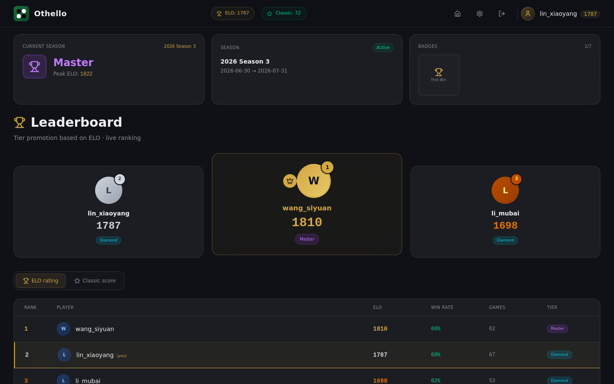
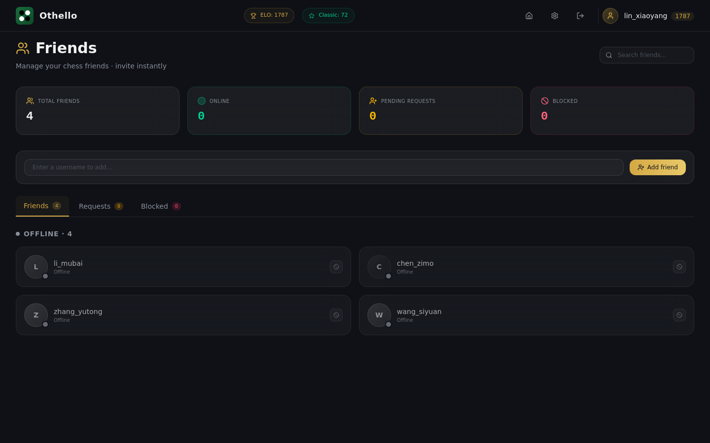

# Othello Platform

**[中文](./README.md)**

A full-stack online Othello (Reversi) game platform. Server-authoritative play, real-time WebSocket matches, multi-level AI opponents, replay analysis, spectating, tactics puzzles, and seasonal ranks — ready to run out of the box.

## Features

- **Server-authoritative matches**: the rules kernel runs on the server to prevent cheating; moves sync in real time over WebSocket
- **AI opponents**: pure-TypeScript NegaScout + bitboard, six levels (L0–L5); runs in a front-end Web Worker / server worker-thread pool so the main thread never blocks
- **Game modes**: PvP (create/join rooms, password rooms, auto-matching), friend challenges, offline practice vs AI
- **Replay & analysis**: move-by-move replay, AI game analysis, notation import/export
- **Spectating**: watch live games in real time
- **Progression**: tactics puzzles, daily challenges, seasonal ranks, badges, leaderboards
- **Accounts**: sign up / log in, JWT + automatic refresh-token rotation, password reset
- **Internationalization**: 中文 / English
- **Dark theme**: glassmorphism style, system font stack

## Screenshots

<table>
  <tr>
    <td align="center" colspan="2"><br><sub>Landing · Platform Highlights</sub></td>
  </tr>
  <tr>
    <td align="center" width="50%"><br><sub>Home · Action Hub</sub></td>
    <td align="center" width="50%"><br><sub>Lobby · Live Room List</sub></td>
  </tr>
  <tr>
    <td align="center"><br><sub>Online Match · Real-time Sync</sub></td>
    <td align="center"><br><sub>Replay · AI Analysis Panel</sub></td>
  </tr>
  <tr>
    <td align="center"><br><sub>Tactics Puzzles · Daily Challenge</sub></td>
    <td align="center"><br><sub>Leaderboard · Seasonal Ranks</sub></td>
  </tr>
  <tr>
    <td align="center" colspan="2"><br><sub>Friends · Online Status & Challenges</sub></td>
  </tr>
</table>

## Tech Stack

| Layer     | Technology                                                                                                        |
| --------- | ----------------------------------------------------------------------------------------------------------------- |
| Frontend  | Vue 3.5 · TypeScript · Tailwind CSS 4 · Vite · Pinia · vue-router · vue-i18n · reka-ui · vue-sonner · @lucide/vue |
| Backend   | Node 22 · Fastify 5 · ws · `pg` (raw SQL, no ORM) · argon2 · pino                                                 |
| Database  | PostgreSQL 18 (Docker Compose)                                                                                    |
| AI        | Pure-TypeScript NegaScout + bitboard                                                                              |
| Contracts | `packages/shared` (Zod schemas + TS types, single source of truth)                                                |
| Tooling   | pnpm 11 monorepo (`packages/*` + `apps/*`)                                                                        |

## Getting Started

### Prerequisites

- Node.js ≥ 22
- pnpm ≥ 11
- Docker (for PostgreSQL)

### Install & Run

```bash
# 1. Install dependencies
pnpm i

# 2. Start PostgreSQL
docker compose up -d

# 3. Configure environment variables
cp .env.example apps/server/.env
# Edit apps/server/.env — at minimum change JWT_SECRET

# 4. Run database migrations
pnpm migrate:up

# 5. Start the backend (http://localhost:3000, tsx watch hot reload)
pnpm dev:server

# 6. In another terminal, start the frontend (http://localhost:5173)
pnpm dev:web
```

Open http://localhost:5173 to start playing.

> If port 3000 is already in use on your machine, change `PORT` in `apps/server/.env` and update the Vite proxy accordingly.
> The frontend dev port (default 5173) and the proxy backend port can be configured via `apps/web/.env.local` — see [`apps/web/.env.example`](./apps/web/.env.example).

### Environment Variables

See [`.env.example`](./.env.example) and [`docs/ops-runbook.md`](./docs/ops-runbook.md) for the full list. Everything except `DATABASE_URL` / `JWT_SECRET` is optional.

## One-Command Docker Deployment

For production, Docker Compose brings up the whole platform (PostgreSQL + backend + nginx frontend) in one command, migrations included:

```bash
# 1. Prepare environment variables
cp .env.prod.example .env
# Edit .env — at minimum change JWT_SECRET (e.g. openssl rand -hex 32)

# 2. Build and start (first run includes image builds)
docker compose -f docker-compose.prod.yml up -d --build

# 3. Check status (migrate should be Exited (0), the rest Up)
docker compose -f docker-compose.prod.yml ps
```

Open http://localhost:3000 to start playing (the host port is set via `WEB_PORT` in `.env`, default 3000).

- Migrations run automatically at startup via a one-shot `migrate` service; the backend waits for it to succeed before starting
- The frontend is served by nginx, which reverse-proxies `/api` and `/ws` to the backend container on the same origin — no CORS to configure
- For cross-platform builds (e.g. building an x64 server image on Apple Silicon), add `--platform linux/amd64`
- See the "Containerized Deployment" section of [`docs/ops-runbook.md`](./docs/ops-runbook.md) for upgrade / rollback / log commands

## Project Structure

```
packages/shared/   — Single source of truth for contracts (types + Zod + DTO + WS/REST contracts, no build, exports src directly)
packages/engine/   — Pure-function rules engine + AI (zero side effects, Board=Uint8Array(64), Bitboard=two bigints)
apps/web/          — Vue 3 frontend (15 pages, Pinia stores, AI Web Worker)
apps/server/       — Fastify backend (WS hub + game runtime + service layer + AI thread pool)
migrations/        — SQL migration files (plain SQL)
docs/              — PRD + appendices + ops runbook + page design mockups
```

## Common Scripts

```bash
pnpm -r typecheck    # Type-check all packages (web uses vue-tsc)
pnpm -r test         # Run Vitest across all packages
pnpm lint            # ESLint (flat config)
pnpm build           # Build all packages
pnpm migrate:up      # Run SQL migrations
pnpm migrate:down    # Roll back migrations
```

## Testing

```bash
pnpm -r test
```

- Unit tests: Vitest (engine rules kernel & AI, server service layer)
- CI runs `typecheck + lint + test` (see [`.github/workflows/ci.yml`](./.github/workflows/ci.yml))

## Documentation

- [`docs/prd.md`](./docs/prd.md) — Product requirements document
- [`docs/ops-runbook.md`](./docs/ops-runbook.md) — Operations runbook
- `docs/appendix-a~d` — Glossary & conventions / acceptance criteria / WS contracts & state machines / task checklist
- `docs/pages/*.html` — Page design mockups

## Contributing

Issues and pull requests are welcome. Please read [CONTRIBUTING.md](./CONTRIBUTING.md) before you start.

## Security

If you find a security vulnerability, please **do not** open a public issue — report it privately following [SECURITY.md](./SECURITY.md).

## License

[MIT](./LICENSE) © Hex
