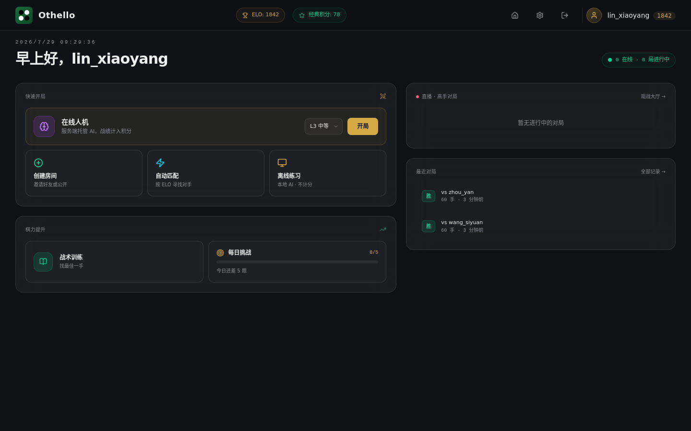
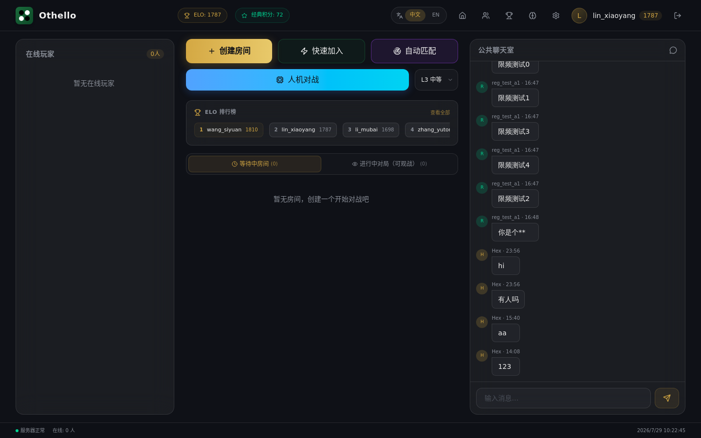
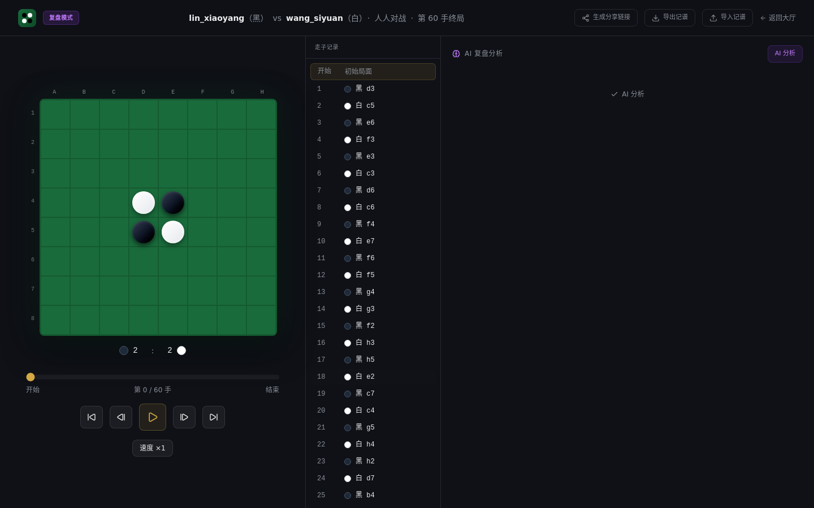
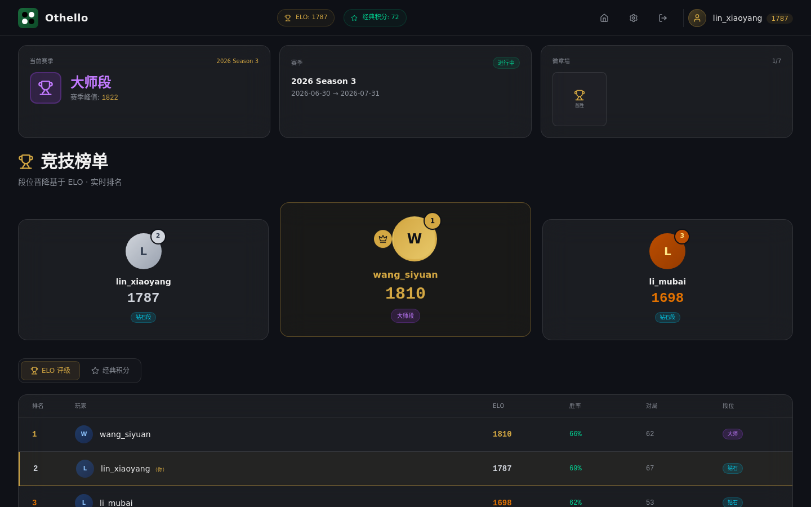
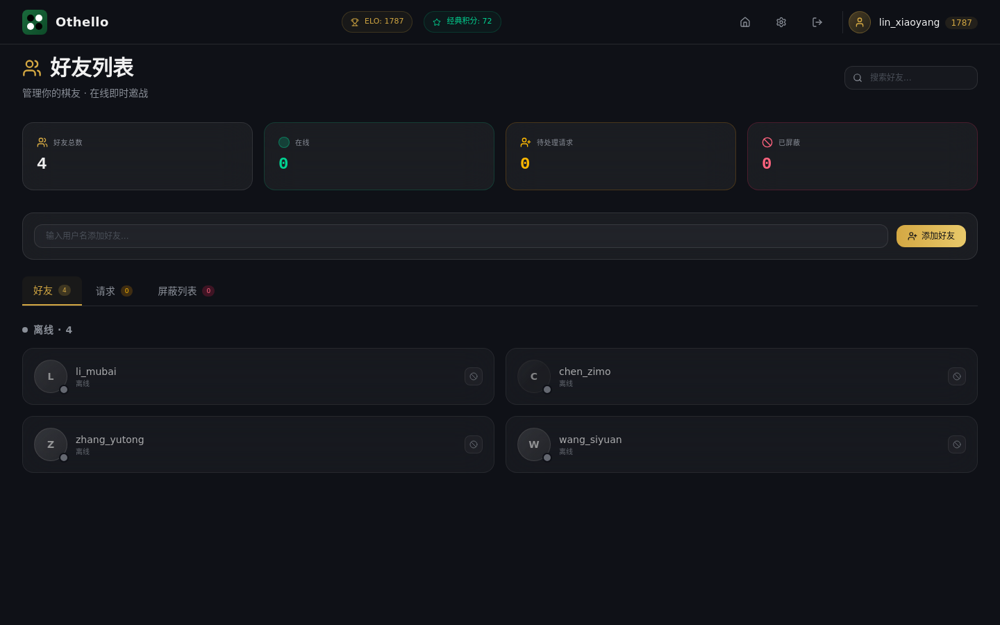

# Othello Platform

**[English](./README.en.md)**

一个全栈黑白棋（Othello / Reversi）在线对战平台。服务端权威校验、实时 WebSocket 对战、多档 AI 人机、复盘分析、观战、战术题库与赛季段位，开箱即用。

## 特性

- **服务端权威对战**：规则内核在服务端执行，防作弊；WebSocket 实时同步落子
- **AI 人机**：纯 TypeScript NegaScout + bitboard，L0–L5 六档难度；前端 Web Worker / 服务端 worker 线程池，不阻塞主线程
- **对战模式**：人人对战（建房/加入/口令房/自动匹配）、好友挑战、离线人机练习
- **复盘与分析**：棋谱回放、AI 复盘分析、记谱导入导出
- **观战**：实时观看他人对局
- **成长体系**：战术题库、每日挑战、赛季段位、徽章、排行榜
- **账号体系**：注册/登录、JWT + refresh token 自动续期、密码重置
- **国际化**：中文 / English
- **暗色主题**：玻璃拟态风格，系统字体栈

## 界面预览

<table>
  <tr>
    <td align="center" colspan="2"><br><sub>未登录首页 · 平台亮点</sub></td>
  </tr>
  <tr>
    <td align="center" width="50%"><br><sub>首页 · 行动中枢</sub></td>
    <td align="center" width="50%"><br><sub>对战大厅 · 实时房间列表</sub></td>
  </tr>
  <tr>
    <td align="center"><br><sub>在线对局 · 实时同步</sub></td>
    <td align="center"><br><sub>复盘 · AI 分析面板</sub></td>
  </tr>
  <tr>
    <td align="center"><br><sub>战术题库 · 每日挑战</sub></td>
    <td align="center"><br><sub>排行榜 · 赛季段位</sub></td>
  </tr>
  <tr>
    <td align="center" colspan="2"><br><sub>好友系统 · 在线状态与邀战</sub></td>
  </tr>
</table>

## 技术栈

| 层     | 技术                                                                                                              |
| ------ | ----------------------------------------------------------------------------------------------------------------- |
| 前端   | Vue 3.5 · TypeScript · Tailwind CSS 4 · Vite · Pinia · vue-router · vue-i18n · reka-ui · vue-sonner · @lucide/vue |
| 后端   | Node 22 · Fastify 5 · ws · `pg`（原生 SQL，无 ORM）· argon2 · pino                                                |
| 数据库 | PostgreSQL 18（Docker Compose）                                                                                   |
| AI     | 纯 TypeScript NegaScout + bitboard                                                                                |
| 契约   | `packages/shared`（Zod schema + TS 类型，单一来源）                                                               |
| 工程   | pnpm 11 monorepo（`packages/*` + `apps/*`）                                                                       |

## 快速开始

### 前置要求

- Node.js ≥ 22
- pnpm ≥ 11
- Docker（用于 PostgreSQL）

### 安装与启动

```bash
# 1. 安装依赖
pnpm i

# 2. 启动 PostgreSQL
docker compose up -d

# 3. 配置环境变量
cp .env.example apps/server/.env
# 编辑 apps/server/.env，至少修改 JWT_SECRET

# 4. 运行数据库迁移
pnpm migrate:up

# 5. 启动后端（http://localhost:3000，tsx watch 热重载）
pnpm dev:server

# 6. 另开终端，启动前端（http://localhost:5173）
pnpm dev:web
```

打开 http://localhost:5173 即可开始。

> 若本机 3000 端口被占用，可在 `apps/server/.env` 中改 `PORT`，并同步调整 Vite proxy。
> 前端开发端口（默认 5173）与 proxy 后端端口可通过 `apps/web/.env` 配置，见 [`apps/web/.env.example`](./apps/web/.env.example)。

### 环境变量

完整列表见 [`.env.example`](./.env.example) 与 [`docs/ops-runbook.md`](./docs/ops-runbook.md)。除 `DATABASE_URL` / `JWT_SECRET` 外均为可选。

## Docker 一键部署

生产环境可用 Docker Compose 一键拉起完整平台（PostgreSQL + 后端 + 前端 nginx），含自动迁移：

```bash
# 1. 准备环境变量
cp .env.prod.example .env
# 编辑 .env，务必修改 JWT_SECRET（如 openssl rand -hex 32）

# 2. 构建并启动（首次含镜像构建）
docker compose -f docker-compose.prod.yml up -d --build

# 3. 查看状态（migrate 应为 Exited (0)，其余 Up）
docker compose -f docker-compose.prod.yml ps
```

打开 http://localhost:3000 即可（宿主机端口经 `.env` 的 `WEB_PORT` 配置，默认 3000）。

- 迁移由一次性 `migrate` 服务在启动时自动执行，后端待其成功后才启动
- 前端经 nginx 同源反代 `/api` 与 `/ws` 到后端容器，无 CORS 配置负担
- 跨平台构建（如在 Apple Silicon 上构建 x64 服务器镜像）加 `--platform linux/amd64`
- 升级/回滚/日志等容器运维命令见 [`docs/ops-runbook.md`](./docs/ops-runbook.md)「容器化部署」

## 目录结构

```
packages/shared/   — 契约单一来源（类型 + Zod + DTO + WS/REST 契约，无 build，直接导出 src）
packages/engine/   — 纯函数规则引擎 + AI（零副作用，Board=Uint8Array(64)，Bitboard=两个 bigint）
apps/web/          — Vue 3 前端（15 页面，Pinia stores，AI Web Worker）
apps/server/       — Fastify 后端（WS hub + 游戏运行时 + 服务层 + AI 线程池）
migrations/        — SQL 迁移文件（纯 SQL）
docs/              — PRD + 附录 + 运维手册 + 页面设计稿
```

## 常用脚本

```bash
pnpm -r typecheck    # 全包类型检查（web 用 vue-tsc）
pnpm -r test         # 全包 Vitest 测试
pnpm lint            # ESLint（flat config）
pnpm build           # 全包构建
pnpm migrate:up      # 运行 SQL 迁移
pnpm migrate:down    # 回滚迁移
```

## 测试

```bash
pnpm -r test
```

- 单元测试：Vitest（engine 规则内核与 AI、server 服务层）
- CI 跑 `typecheck + lint + test`（见 [`.github/workflows/ci.yml`](./.github/workflows/ci.yml)）

## 文档

- [`docs/prd.md`](./docs/prd.md) — 产品需求文档
- [`docs/ops-runbook.md`](./docs/ops-runbook.md) — 运维手册
- `docs/appendix-a~d` — 术语约定 / 验收标准 / WS 契约与状态机 / 任务清单
- `docs/pages/*.html` — 页面设计稿

## 贡献

欢迎提交 Issue 与 Pull Request。开始前请阅读 [CONTRIBUTING.md](./CONTRIBUTING.md)。

## 安全

发现安全漏洞请**不要**公开提交 Issue，按 [SECURITY.md](./SECURITY.md) 私下上报。

## 许可证

[MIT](./LICENSE) © Hex

## 友情链接

学AI上L站！ https://linux.do/
